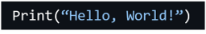
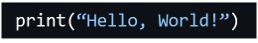
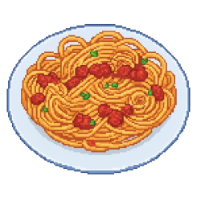
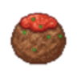
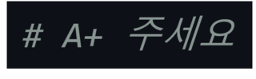

bug_catcher
===
tkinter를 기반으로 구현한 코딩 학습용 종스크롤 슈팅 게임입니다.
</br></br>

레포토리지 구조
---
```
├── BugCatcherGame                      프로젝트 폴더
│    ├── media                          에셋
│    │    ├── image
│    │    │    ├── backgrounds
│    │    │    │    ├── ...
│    │    │    ├── entities
│    │    │    │    ├── ...
│    │    │    └── ui_elements
│    │    │         ├── ...
│    │    ├── music
│    │    │    ├── bgm
│    │    │    │    ├── ...
│    │    │    └── effect
│    │    │         ├── ...
│    ├── BugCacherGame.py               실행 py 코드
│    └── BugCatcherGame.pyproj
├── BugCatcherSolution.sln              솔루션 파일
└── README.md
```
</br></br>

실행 영상
---
[](https://youtu.be/APZV5y0KOkA)
</br></br>

게임 설명
---
### 조작키
* 방향키: ↑, ←, ↓, → (설정창에서 W, A, S, D 키로 변경 가능)   
* 공격키: SPACE (설정창에서 다른 키로 변경 가능, 일부 불가능한 키 존재)
* 확인키: ENTER   
* 일시정지 또는 나가기: ESC
</br>

### 게임 방법
* 방향키로 플레이어를 조작하며 공격키를 누르면 커서를 발사합니다.
* 위에서 아래로 랜덤으로 엔티티가 내려옵니다. 엔티티에는 에러 코드, 클린 코드, 아이템 총 세 종류가 있고 아이템에는 커피, 마감일, ai 총 세 가지가 있습니다.
<table>
  <tr>
    <td align="center">에러 코드</td>
    <td align="center"></td>
    <td align="center">문법적으로 틀린 코드 또는 실행 결과가 다른 코드입니다.<br>커서로 에러 코드를 맞춰 없애면 점수를 획득합니다.<br>반면 에러 코드가 바닥에 닿으면 점수를 잃으며,<br>플레이어와 충돌하면 점수를 잃고 체력이 1 감소됩니다. </td>
  </tr>
  <tr>
    <td align="center">클린 코드</td>
    <td align="center"></td>
    <td align="center">문법적으로 올바르고 실행 결과가 옳은 코드입니다.<br>클린 코드에 닿거나 성공적으로 바닥으로 내려오면 점수를 획득합니다.<br>하지만 커서로 맞추면 점수를 잃습니다.</td>
  </tr>
  <tr>
    <td align="center">커피</td>
    <td align="center"></td>
    <td align="center">플레이어와 닿으면 체력을 1 회복합니다.<br>커서에 닿아도 사라지거나 효과를 얻지 않습니다.</td>
  </tr>
  <tr>
    <td align="center">마감일</td>
    <td align="center"></td>
    <td align="center">5초간 스피드가 상승합니다.</td>
  </tr>
  <tr>
    <td align="center">ai</td>
    <td align="center"></td>
    <td align="center">바이브 코딩 모드로 돌입합니다.<br>바이브 코딩 모드가 되면 플레이어의 일정 범위에 있는<br>에러 코드가 자동으로 삭제됩니다.<br>또한 아이템을 자동으로 획득해줍니다.</td>
  </tr>
</table>

* 플레이어는 점수와 체력 수치를 가지고 있습니다. 
  * 플레이어는 점수가 10000점에 도달할 때마다 보스전을 치루게 됩니다. 
  * 체력은 기본적으로 총 3개를 가지고 시작합니다. 체력이 0이 되면 게임 오버 됩니다.
* 엔딩은 존재하지 않습니다. while True로 게임을 즐겨보세요!
</br>

### 보스전


보스전에서는 스파게티 코드와 싸우게 됩니다. 
* 스파게티 코드는 고유한 수치인 **엉킴 게이지** 를 갖고 있습니다. 엉킴 게이지는 100%부터 시작하며 0%에 도달하면 승리할 수 있습니다. 
* 일반 게임에서는 존재하지 않는 보스전만의 특별한 기믹들을 볼 수 있습니다.
<table>
  <tr>
    <td align="center"></td>
    <td align="center">스파게티 코드는 미트볼을 생성합니다.<br>미트볼에 닿으면 hp가 1 감소하고 엉킴 게이지가 증가합니다.<br>커서를 명중시켜 미트볼을 없앨 수 있으며 미트볼을 없애면 엉킴 게이지가 감소합니다.</td>
  </tr>
  <tr>
    <td align="center"></td>
    <td align="center">새로운 아이템, 에너지 드링크가 등장합니다.<br>에너지 드링크를 획득하면 5초간 엉킴 게이지 감소율이 증가합니다.</td>
  </tr>
  <tr>
    <td align="center"></td>
    <td align="center">일정 간격을 두고 쓸모 없는 주석을 발생시킵니다.<br>경고 표시가 나타나고 일정 시간 이후 쓸모 없는 주석이 배치됩니다.<br>쓸모 없는 주석이 게임 내에 있으면 엉킴 게이지는 천천히 증가합니다.<br>플레이어는 쓸모 없는 주석 안으로 들어갈 수도 있습니다.<br>주석 내부로 들어가면 스피드가 느려지고<br>쓸모 없는 주석으로 인한 엉킴 게이지 증가율이 상승합니다.<br>커서를 명중시켜 쓸모 없는 주석을 없앨 수 있습니다.</td>
  </tr>
</table>
</br></br>

소스 출처
---
player.png &emsp; [Kenny - Pixel Shmup](https://www.kenney.nl/assets/pixel-shmup)   
cursor.png &emsp; [Kenny - Cursor Pixel Pack](https://www.kenney.nl/assets/cursor-pixel-pack)    
coffee.png &emsp; [Kenny - Pixel PlatFormer Food Expansion](https://www.kenney.nl/assets/pixel-platformer-food-expansion)   
hp_full.png, hp_empty.png, ai.png	&emsp; [Kenny - Pixel Platformer](https://www.kenney.nl/assets/pixel-platformer)   
interface.png, chat_window.png &emsp; [itch.io - Retro Windows GUI](https://comp3interactive.itch.io/retro-windows-gui)   
arrow_selected.png, arrow_unselected.png, wasd_selected.png, wasd_unselected.png &emsp; [itch.io - PIXEL FANTASY RPG ICONS - Keyboard Buttons](https://cazwolf.itch.io/caz-pixel-keyboard)   
deadline.png, spagetti01.png, spagetti02.png, drink.png &emsp; 구글 Gemini 제작
</br>

title_bgm.mp3 &emsp; [魔王魂 - 8bit17](https://maou.audio/bgm_8bit17/)   
main_game_bgm.mp3 &emsp; [魔王魂 - 8bit28](https://maou.audio/bgm_8bit28/)   
low_hp_bgm.mp3 &emsp; [pixabey - 8 bit heart beat final](https://pixabay.com/ko/sound-effects/8-bit-heart-beat-final-26366/)   
vs_boss_bgm.mp3 [魔王魂 - 8bit15](https://maou.audio/bgm_8bit15/)   
game_over_bgm.mp3 [魔王魂 - 8bit03](https://maou.audio/bgm_8bit03/)   
</br>

select.mp3 &emsp; [みんなの創作支援サイトＴスタ/T-STUDIO - UI효과: 선택 1](https://tnosite.com/ko/user-interface-sound-effects-3/)   
death &emsp; [pixabay - 8-Bit Explosion 3](https://pixabay.com/sound-effects/8-bit-explosion-3-340456/)   
buff &emsp; [pixabay - 8-Bit Powerup](https://pixabay.com/sound-effects/8-bit-powerup-6768/)   
debuff &emsp; [みんなの創作支援サイトＴスタ/T-STUDIO - UI효과: 취소 5](https://tnosite.com/ko/user-interface-sound-effects-3/)   
shoot &emsp; [pixabay - Fire](https://pixabay.com/ko/sound-effects/fire-88783/)   
</br>

전부 CCO 에셋 사용하였습니다.
그 외 기재되지 않은 에셋들은 직접 제작했습니다.
</br></br>


etc
---
> 약 스포일러 주의!

타 게임 오마주 요소가 게임 내에 포함되어 있습니다.
</br></br>
게임 언더테일의 게임 오버 방식을 오마주 했습니다.   
* 원본   
[](https://www.youtube.com/watch?v=6S21ZSsC21U)   
* 오마주   
[](https://youtube.com/shorts/xR1til4t_XA)
</br></br>

게임 PokeRogue의 보스 무한다이노의 대사를 오마주 했습니다.
<table>
  <tr>
    <td align="center"></td>
    <td align="center"></td>
  </tr>
  <tr>
    <td align="center">원본</td>
    <td align="center">오마주</td>
  </tr>
</table>  
